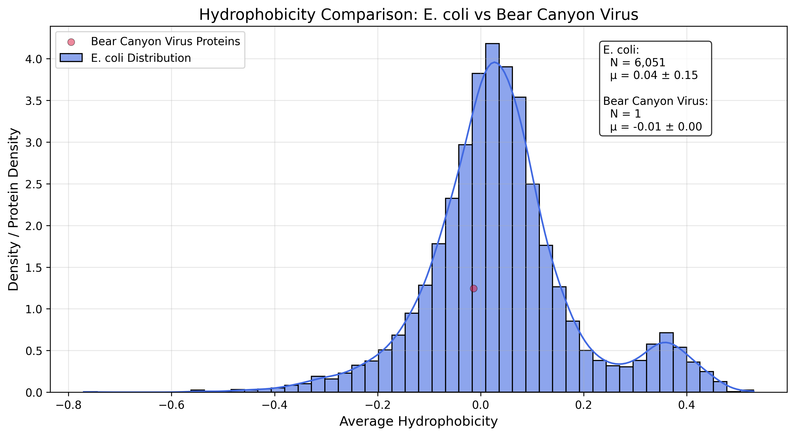
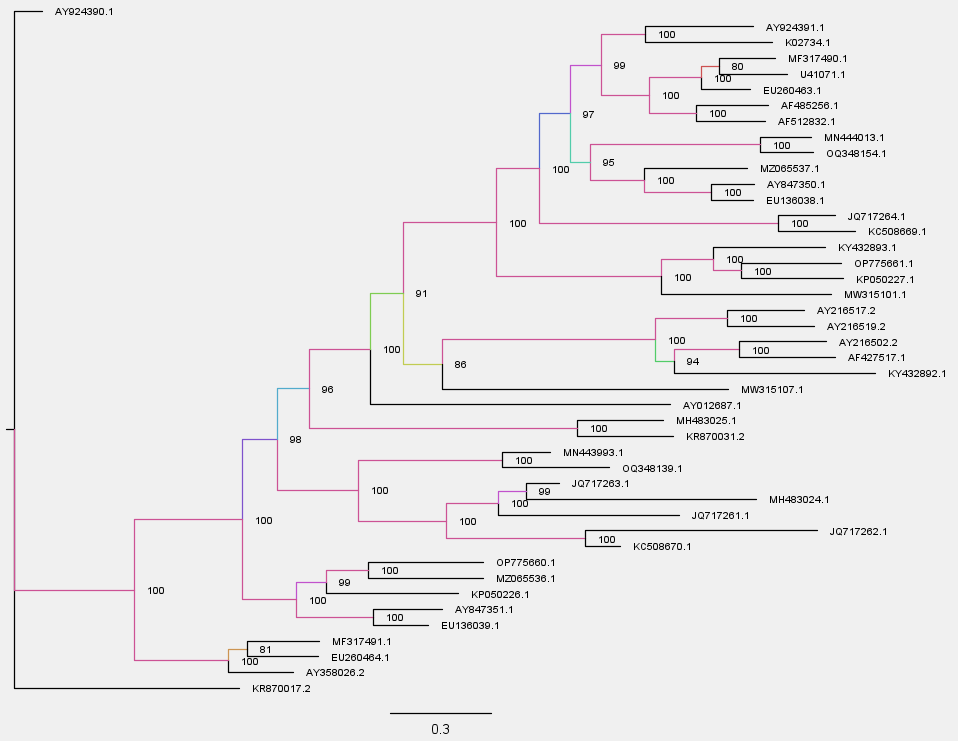

Final
Bear Canyon Virus Sequence Analysis Project

Author
Cade Cook

Date
5/6/2025

Accession
L: AY924390; S: AY924391

Introduction

Viral classification:

ICTV: The Bear Canyon Virus is a Mammarenavirus, or, more specifically, Mammarenavirus bearense.
Baltimore: Class IV: single-strand RNA viruses with DNA-like RNA.
ICTV. (n.d.). Taxon Details | ICTV. Ictv. Retrieved 23 April. 2025, from https://ictv.global/taxonomy/taxondetails?taxnode_id=202402572. 
9.3B: The Baltimore Virus Classification - Biology LibreTexts. (n.d.). Bio. Retrieved 23 April. 2025, from https://bio.libretexts.org/Bookshelves/Microbiology/Microbiology_(Boundless)/09:_Viruses/9.03:_Classifying_Viruses/9.3B:_The_Baltimore_Virus_Classification. 

Physical size of your virus, and how does this compare to the size of a human cell and SARS-CoV-2?

The sizes of the virus vary, but it tends to range from 60 to 300nm in diameter, which is larger than SARS-CoV-2, though smaller than most human cells.
ViralZone. (n.d.). Mammarenavirus ~ ViralZone. Viralzone. Retrieved 23 April. 2025, from https://viralzone.expasy.org/83. 

What is the shape of your virus, and does it have an envelope?

The shape of the Bear Canyon virus is spherical, and it does have an envelope.
ViralZone. (n.d.). Mammarenavirus ~ ViralZone. Viralzone. Retrieved 23 April. 2025, from https://viralzone.expasy.org/83. 

When was your virus first described? When was the last outbreak?

The Bear Canyon virus was first discovered in 1998. The last known outbreak is unknown since the virus affects rodents rather than humans, so most cases have not been recorded. 
Fulhorst, C. (2002, November 07). Bear Canyon Virus: An Arenavirus Naturally Associated with the California Mouse (Peromyscus californicus) - Volume 8, Number 7—July 2002 - Emerging Infectious Diseases journal - CDC. Wwwnc. Retrieved 23 April. 2025, from https://wwwnc.cdc.gov/eid/article/8/7/01-0281_article. 

What does your virus infect? Is it specific to a particular host, or is it more general?

This virus infects rodents and has mostly been found in mice.
Fulhorst, C. (2002, November 07). Bear Canyon Virus: An Arenavirus Naturally Associated with the California Mouse (Peromyscus californicus) - Volume 8, Number 7—July 2002 - Emerging Infectious Diseases journal - CDC. Wwwnc. Retrieved 23 April. 2025, from https://wwwnc.cdc.gov/eid/article/8/7/01-0281_article. 

How does your virus penetrate the cell?

I could not find any sources specifically stating how the Bear Canyon Virus enters a host cell, but this virus is part of the Mammarenavirus genus, and research has shown that it acts similarly to arenaviruses. Assuming this is true, it can be inferred that the Bear Canyon Virus uses its surface glycoprotein complex to attach to host cell receptors and then enters through receptor-mediated endocytosis. 
Fulhorst, Charles & Bennett, Stephen & Milazzo, Mary & Murray, Hugh & Webb, James & Cajimat, Maria & Bradley, Robert. (2002). Bear Canyon Virus: An Arenavirus Naturally Associated with the California Mouse (Peromyscus californicus). Emerging infectious diseases. 8. 717-21. 10.3201/eid0807.010281. (PDF) Bear Canyon Virus: An Arenavirus Naturally Associated with the California Mouse (Peromyscus californicus)
Hallam, S. (2018, August 02). Frontiers | Review of Mammarenavirus Biology and Replication. Frontiersin. Retrieved 01 May. 2025, from https://frontiersin.org/journals/microbiology/articles/10.3389/fmicb.2018.01751/full. 

How does your virus replicate? Does it have its own genetic machinery, or does it hijack its host?

We are still not fully sure how the Bear Canyon virus replicates, but as an arenavirus and a single-stranded RNA virus, we can assume how it replicates. Knowing that it is a single-stranded RNA virus, we know it can not use its own genome as mRNA, so it needs to hijack a host cell. Once again, assuming that the Bear Canyon virus replicates like most arenaviruses, we can assume that after entering the cell, it initiates transcription using the host mRNAs. The viral mRNAs will then be translated by the host and replicate viral proteins.
ViralZone. (n.d.). Arenaviridae ~ ViralZone. Viralzone. Retrieved 01 May. 2025, from Arenaviridae ~ ViralZone 
Hallam, S. (2018, August 02). Frontiers | Review of Mammarenavirus Biology and Replication. Frontiersin. Retrieved 01 May. 2025, from https://frontiersin.org/journals/microbiology/articles/10.3389/fmicb.2018.01751/full.
Arenavirus - Wikipedia. (n.d.). Wikipedia. Retrieved 01 May. 2025, from https://en.wikipedia.org/wiki/Arenavirus. 

Describe how your virus gets released into the cell. Does it kill the cell, bud from the host cell, or is it excreted by the host cell?

Like other arenaviruses, the Bear Canyon virus gets released through budding from the plasma membrane. This process does not usually kill the host cell.
ViralZone. (n.d.). Arenaviridae ~ ViralZone. Viralzone. Retrieved 01 May. 2025, from Arenaviridae ~ ViralZone 

Does your virus show any signs of latency?

There have been signs of no true latency with the Bear Canyon virus, and it is believed to maintain a long-term infection with ongoing replication within mice. 
Fulhorst, C. (2002, July 08). Bear Canyon Virus: An Arenavirus Naturally Associated with the California Mouse (Peromyscus californicus) - PMC . Pmc. Retrieved 01 May. 2025, from https://pmc.ncbi.nlm.nih.gov/articles/PMC2730321/. 

Is your virus considered in equilibrium with humans? Does it show any antigenic shift?

As of right now, there have been no signs of equilibrium with humans, and the Bear Canyon virus has only been shown to infect mice. Also, there has been no sign found for antigenic shift, and the virus instead shows signs of genetic stability.
Arenaviridae | ICTV. (2009). ICTV Global. Retrieved 01 May. 2025, from https://ictv.global/report_9th/RNAneg/Arenaviridae. 

Are there any vaccines available for your virus? What is the mechanism underlying the vaccine? 

There are no current vaccines for the Bear Canyon virus, most likely because it does not infect humans and is nonlethal to its actual host.

Are any anti-viral drugs available for your virus? How do they work?

There are no current anti-viral drugs specifically for the Bear Canyon virus, but there are anti-viral drugs for other arenaviruses, such as ribavirin. This drug attacks certain arenaviruses by increasing the mutation rate in the genome.
Begum, J. (2024, August 04). What Are Arenaviruses (Arenaviridae)?. Webmd. Retrieved 01 May. 2025, from https://webmd.com/a-to-z-guides/what-are-arenaviruses-arenaviridae. 
DrugBank. (n.d.). Ribavirin. DrugBank. Retrieved 01 May. 2025, from https://go.drugbank.com/drugs/DB00811. 

Final Project: Methods

Step 1: Download Virus Sequences
from Bio import Entrez

Entrez.email = "ccook103@charlotte.edu"
handle = Entrez.efetch(db="nucleotide", id="AY924390", rettype="fasta", retmode="text")
record_L = handle.read()
handle.close()

handle = Entrez.efetch(db="nucleotide", id="AY924391", rettype="fasta", retmode="text")
record_S = handle.read()
handle.close()

with open("AY924390.fasta", "w") as f:
    f.write(record_L)
with open("AY924391.fasta", "w") as f:
    f.write(record_S)

Step 2: Find ORFs >300bp
from Bio import SeqIO
from Bio.Seq import Seq
from typing import List, Dict

def find_orfs(seq_record: SeqIO.SeqRecord, min_length: int = 300) -> List[Dict]:
    orfs = []
    sequence = seq_record.seq
    seq_length = len(sequence)
    start_codons = ['ATG']
    stop_codons = ['TAA', 'TAG', 'TGA']
    for frame in range(6):
        is_reverse = frame >= 3
        frame_offset = frame % 3
        working_seq = sequence.reverse_complement() if is_reverse else sequence
        working_seq = working_seq[frame_offset:]
        pos = 0
        while pos + 3 <= len(working_seq):
            codon = str(working_seq[pos:pos+3])
            if codon in start_codons:
                start = pos
                end = pos + 3
                has_stop = False
                while end + 3 <= len(working_seq):
                    codon = str(working_seq[end:end+3])
                    if codon in stop_codons:
                        has_stop = True
                        end += 3
                        break
                    end += 3
                if has_stop and end - start >= min_length:
                    original_start = seq_length - (frame_offset + end) if is_reverse else frame_offset + start
                    original_end = seq_length - (frame_offset + start) if is_reverse else frame_offset + end
                    orfs.append({
                        'sequence_id': seq_record.id,
                        'start': original_start,
                        'end': original_end,
                        'length': end - start,
                        'strand': '-' if is_reverse else '+',
                        'frame': frame + 1,
                        'protein': working_seq[start:end].translate()
                    })
                pos = end
            else:
                pos += 3
    return orfs

def find_all_orfs(genome_file: str, min_length: int = 300) -> List[Dict]:
    all_orfs = []
    file_format = 'fasta' if genome_file.endswith(('.fasta', '.fa')) else 'genbank'
    with open(genome_file, 'r') as fh:
        for record in SeqIO.parse(fh, file_format):
            all_orfs.extend(find_orfs(record, min_length))
    return all_orfs

print("\nProcessing sequence_long.fasta")
long_orfs = find_all_orfs("sequence_long.fasta")
print(f"Found {len(long_orfs)} ORFs ≥300bp in sequence_long.fasta")

print("\nProcessing sequence_short.fasta")
short_orfs = find_all_orfs("sequence_short.fasta")
print(f"Found {len(short_orfs)} ORFs ≥300bp in sequence_short.fasta")

Step 3: Download Comparison Viruses
from Bio import Entrez
import time

Entrez.email = "ccook103@charlotte.edu"
accession_codes = {
    "BearCanyon-L": "AY924390", "BearCanyon-S": "AY924391",
    "Batang-L": "MN443993", "Batang-S": "MN444013",
    "Apore-L": "MF317491", "Apore-S": "MF317490",
    "Ampari-L": "AY216517", "Ampari-S": "AF485256",
    "Allpahuayo-L": "AY216502", "Allpahuayo-S": "AY012687",
    "Alxa-L": "KY432892", "Alxa-S": "KY432893",
    "AbaMianyang-L": "OQ348139", "AbaMianyang-S": "OQ348154",
    "Berega-L": "OP775660", "Berega-S": "OP775661",
    "Bitu-L": "MZ065536", "Bitu-S": "MZ065537",
    "Sabia-L": "AY358026", "Sabia-S": "U41071",
    "Pichinde-L": "AF427517", "Pichinde-S": "K02734",
    "Souris-L": "KP050226", "Souris-S": "KP050227",
    "Chapare-L": "EU260464", "Chapare-S": "EU260463",
    "LCMV-L": "AY847351", "LCMV-S": "AY847350",
    "Dandenong-L": "EU136039", "Dandenong-S": "EU136038",
    "Cupixi-L": "AY216519", "Cupixi-S": "AF512832",
    "GoldenGate-L": "JQ717263", "GoldenGate-S": "JQ717264",
    "CAS-L": "JQ717261", "CAS-S": "JQ717262",
    "ROUT-L": "KC508670", "ROUT-S": "KC508669",
    "OldSchoolhouse-L": "MH483025", "OldSchoolhouse-S": "MH483024",
    "HaartmanSnake-L": "KR870031", "HaartmanSnake-S": "KR870017",
    "BeijiNairovirus-L": "MW315101", "BeijiNairovirus-S": "MW315107"
}

def fetch_arenavirus_fasta(accession_codes):
    sequences = {}
    for name, accession in accession_codes.items():
        try:
            with Entrez.efetch(db="nucleotide", id=accession, rettype="fasta", retmode="text") as handle:
                fasta_data = handle.read().strip()
                sequences[name] = fasta_data
                print(f"Retrieved {name} ({accession})")
                time.sleep(0.35)
        except Exception as e:
            print(f"Error retrieving {name} ({accession}): {str(e)}")
            sequences[name] = None
    return sequences

fasta_sequences = fetch_arenavirus_fasta(accession_codes)

with open("all_arenaviruses.fasta", "w") as f:
    for name, fasta in fasta_sequences.items():
        if fasta:
            f.write(fasta + "\n\n")

Step 4: Calculate Sequence Lengths
from Bio import SeqIO
from io import StringIO

print("\n{:<30} | {:<12} | {}".format("Virus Name", "Accession", "Length (bp)"))
print("-" * 60)
for name, accession in accession_codes.items():
    fasta = fasta_sequences.get(name)
    if not fasta:
        print(f"{name:<30} | {accession:<12} | Retrieval failed")
        continue
    try:
        record = SeqIO.read(StringIO(fasta), "fasta")
        print(f"{name:<30} | {accession:<12} | {len(record.seq):,} bp")
    except Exception as e:
        print(f"{name:<30} | {accession:<12} | Invalid format")

Step 5: MAFFT SLURM Script
Save as mafft_align.slurm:
#!/bin/bash
#SBATCH --job-name=mafft_align
#SBATCH --output=mafft_align.out
#SBATCH --error=mafft_align.err
#SBATCH --time=01:00:00
#SBATCH --partition=general
#SBATCH --ntasks=1
#SBATCH --cpus-per-task=4

module load mafft

mafft --auto all_arenaviruses.fasta > aligned_arenaviruses.fasta

Submit on cluster:
sbatch mafft_align.slurm

Final Project: Results and Discussion

---

## Hydrophobicity Comparison Plot

Here’s my hydrophobicity plot comparing E. coli and Bear Canyon Virus:

---

N=6,051 E. coli proteins, with mean μ=0.04±0.15

N=1 Bear Canyon Virus protein, with mean μ=−0.01±0.00

The Bear Canyon Virus has an average hydrophobicity slightly below zero, sitting right at the 
main E. coli distribution peak, meaning it’s roughly similar in hydrophobic profile to most E. coli 
proteins.

Outlier: ID: AY924390.1, ORF: 1  
I identified the most hydrophobic protein in Bear Canyon Virus as an RNA-dependent RNA 
polymerase (RdRp; NCBI RefSeq YP_001649225.1). This enzyme plays a central role in 
replicating the viral RNA genome and is critical for the viral life cycle. Although RdRp does not 
directly mediate viral entry, its activity is essential after entry, supporting genome replication and 
transcription. Its hydrophobic regions might reflect interactions within the replication complex or 
membrane-associated processes.

Strecker, T. (2020, July). ResearchGate - Temporarily Unavailable. Researchgate. Retrieved 04 May 2025, from  
https://researchgate.net/figure/Mammarenavirus-structure-and-genome-composition-Mammarenaviruses-have-a-spherical_fig1_343133261

## Genome Size Histogram

Here’s the genome size histogram showing Bear Canyon Virus relative to other viruses:

## Figtree

