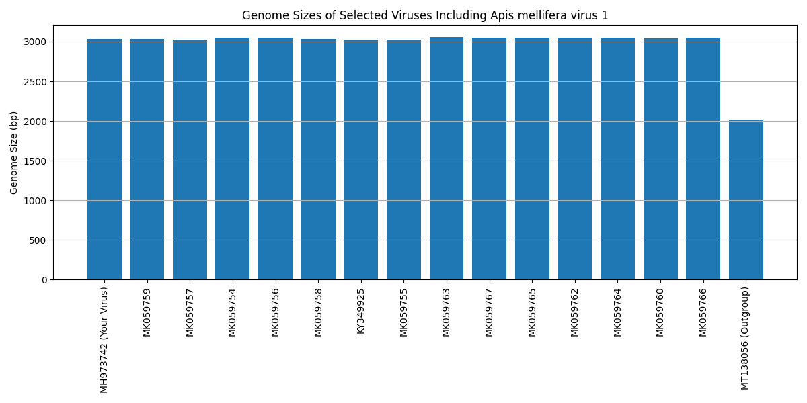

# Final Project: Apis mellifera virus 1

**Author:** Arnav Earve  
**Date:** 5/5/25
**Accession Number:** MH973742  

---

## I. Introduction

Apis mellifera virus 1 is a DNA virus in the genus Torbevirus, and the family Redondoviridae. The ICTV classification is:  
- **Realm:** Monodnaviria  
- **Kingdom:** Shotokuvirae  
- **Phylum:** Cressdnaviricota  
- **Class:** Arfiviricetes  
- **Order:** Recrevirales  
- **Family:** Redondoviridae  
- **Genus:** Torbevirus  
- **Species:** Torbevirus brisa

- Baltimore classification: The Baltimore classification of the virus is class II, because it has single stranded DNA genomes
- Physical size: The physical size of Apis mellifera virus 1 is approximately 30 nm, which is smaller than a typical human cell (~10,000 nm) and smaller than SARS-CoV-2 (~120 nm) [insert citation].
- Shape and envelope: The virus exhibits a icosahedral, a more smaller circular shape, morphology and does not posses an envelope similarily to other viruses of the same family. [insert citation].
- Discovery and outbreaks: Apis mellifera virus 1 was first described in 2019 by accident when scientists were trying to find a different virus of the same family. [insert citation]. There haven't been any prominent outbreaks of the virus which may lead to why there aren't many known facts and research done on this virus. The Redondoviridae family as a whole is fairly new with many viruses still being researched in the more early stages.
- Host range: This virus infects Apis mellifera, more commonly known as the western honey bee and is host specfic virus because it has only been found with bees. [insert citation].
- Cell entry: The virus penetrates the host cell via the endocytoic pathway like many other non enveloped viruses [insert citation].
- Replication strategy: Apis mellifera virus 1 relies on host machinery and replicates by hijacking the host and relying on its replication enzymes. Once the virus hijacks the host, it then uses the DNA polymerase to DNA into double-stranded DNA [insert citation].
- Release mechanism: Viral progeny are released by apoptosis, a process in which the host cell is killed, common among non-enveloped viruses. [insert citation].
- Latency: The virus does not show any signs of latency, similar to many non-enveloped viruses [insert citation].
- Equilibrium and antigenic shift: The virus is not considered in equilibrium with humans, due to the fact the virus has only been known to effect bees. It also does not show any antigenic shift, for the same reason. Since it's only found in bees and doesn't change shift any to different hosts, it doesn't have any antigenic shift. [insert citation].
- Vaccines: There are no current vaccines for Apis Mellifera virus 1. Since it was only discovered in 2019, with no prominent outbreaks since then, and it hasn't spread to humans yet with any known diseases there haven't been any vaccines created yet. If there is a major outbreak, or the threat for this virus increases then we’ll have more research towards the virus and potentially a vaccine.  [insert citation].
- Antiviral drugs: There aren't any known antiviral drugs for this virus. As the honeybee is infected more and more it becomes heavily agressive until it eventually dies. [insert citation].

---

## II. Methods
1. Downloaded the viral genome using the accession number **MH973742**. The code to achieve is this below. 
from Bio import Entrez, SeqIO

Entrez.email = "aearve@uncc.edu"  # Your email
handle = Entrez.efetch(db="nucleotide", id="MH973742", rettype="fasta", retmode="text")
record = SeqIO.read(handle, "fasta")
handle.close()

with open("MH973742.fasta", "w") as f:
    SeqIO.write(record, f, "fasta")

2. Find open reading frames longer than 300bp, while making sure to determine the correct start and stop codons of the virus. Doing this helps with getting better and more functional proteins.  The code to achieve is this below.
   from Bio import SeqIO
from Bio.SeqRecord import SeqRecord

def find_orfs(seq, min_len=300):
    orfs = []
    count = 1
    for strand, nuc in [(+1, seq), (-1, seq.reverse_complement())]:
        for frame in range(3):
            trans = nuc[frame:].translate(to_stop=False)
            aa_start = 0
            for aa_end in range(len(trans)):
                if trans[aa_end] == "*":
                    length = (aa_end - aa_start) * 3
                    if length >= min_len:
                        orf_seq = trans[aa_start:aa_end]
                        desc = f"{strand} strand, frame {frame}"
                        orfs.append(SeqRecord(orf_seq, id=f"Protein_{count}", description=desc))
                        count += 1
                    aa_start = aa_end + 1
    return orfs

record = SeqIO.read("MH973742.fasta", "fasta")
orfs = find_orfs(record.seq)
SeqIO.write(orfs, "MH973742_proteome.fasta", "fasta")

3. Selected 15 viruses from the same genus, two additional viruses in a different genus but the same family, and 1 outgroup from a different family in the same order. I wasn't able to select five additional viruses in a different genus but the same family because only two viruses fit the crteria that was needed.
4. Formatted an accession code object and used the `calculate_sequence_lengths` function to output the lengths of all your downloaded genomes. This was an important step because it helps us ensure an accurate dataset. The code to achieve is this below.
   from Bio import SeqIO

def calculate_sequence_lengths(fasta_file, accession_codes):
    seq_lengths = {}
    for record in SeqIO.parse(fasta_file, "fasta"):
        if record.id in accession_codes:
            seq_lengths[record.id] = len(record.seq)
    print("Genome Lengths:")
    for acc in accession_codes:
        length = seq_lengths.get(acc, "Not found")
        print(f"{acc}: {length} bp")

5. Used a MAFFT SLURM script to align all sequences. The alignment that we got was then used to create a phylogenetic tree. The code to achieve is this below.
   #!/bin/bash
#SBATCH --job-name=mafft_align
#SBATCH --output=mafft_output.txt
#SBATCH --error=mafft_error.txt
#SBATCH --partition=Centaurus
#SBATCH --ntasks=1
#SBATCH --time=00:10:00

module load mafft/7.525woe
mafft --auto all_sequences.fasta > all_sequences_aligned.fasta

6. Constructed a phylogenetic tree using IQ-TREE with model selection and added bootstrap values. The code to achieve is this below.
   #!/bin/bash
#SBATCH --job-name=iqtree_phylogeny
#SBATCH --output=iqtree_output.txt
#SBATCH --error=iqtree_error.txt
#SBATCH --partition=Centaurus
#SBATCH --ntasks=1
#SBATCH --time=00:15:00

module load iqtree
iqtree -s all_sequences_aligned.fasta -m TEST -bb 1000

---

## III. Results and Discussion

### Hydrophobicity Plot  
I generated this plot against the E.coli proteome resulting in Protein 2 having the best hydrophobicity, while Protein 1 had the worst hydrophobicity. The code I used to create this plot is down below.

from Bio import SeqIO
import matplotlib.pyplot as plt

kd = {'A': 1.8, 'C': 2.5, 'D': -3.5, 'E': -3.5, 'F': 2.8,
      'G': -0.4, 'H': -3.2, 'I': 4.5, 'K': -3.9, 'L': 3.8,
      'M': 1.9, 'N': -3.5, 'P': -1.6, 'Q': -3.5, 'R': -4.5,
      'S': -0.8, 'T': -0.7, 'V': 4.2, 'W': -0.9, 'Y': -1.3}

def avg_hydro(seq): return sum(kd.get(aa, 0) for aa in seq) / len(seq)

records = list(SeqIO.parse("MH973742_proteome.fasta", "fasta"))
scores = [avg_hydro(str(r.seq)) for r in records]
names = [r.id for r in records]

plt.bar(names, scores)
plt.xticks(rotation=90)
plt.ylabel("Avg. Hydrophobicity")
plt.title("Hydrophobicity of AMV-1 Proteins")
plt.tight_layout()
plt.savefig("hydrophobicity_plot.png")
plt.show()

### BLAST of Outlier Protein  
Protein 2 was my outlier hydrophobic protein because it had a significantly better hydrophobicity. Since I selected this protein, I then blasted it and the sequence that was annotated was cited as being involved with entry mechanisms. This is a very interesting fact because it is similar to other non-enveloped viruses during viral entry.

### Genome Size Plot  
The genome size of Apis mellifera virus 1 is 3033 bp. I compared this with 15 related viruses, two different viruses and the outgroup virus. Most genomes were around the same of 3000 bp, with the outgroup (MT138056) being smaller at 2015 bp. The code I used to create this plot is down below.

import matplotlib.pyplot as plt
genome_lengths = {
    'MH973742': 3033,
    'MK059759': 3030,
    'MK059757': 3026,
    'MK059754': 3049,
    'MK059756': 3050,
    'MK059758': 3034,
    'KY349925': 3019,
    'MK059755': 3023,
    'MK059763': 3056,
    'MK059767': 3051,
    'MK059765': 3051,
    'MK059762': 3054,
    'MK059764': 3050,
    'MK059760': 3043,
    'MK059766': 3052,
    'MT138056': 2015  # Outgroup
}

plt.figure(figsize=(12, 6))
plt.bar(genome_lengths.keys(), genome_lengths.values())
plt.xticks(rotation=90)
plt.ylabel("Genome Size (bp)")
plt.title("Genome Sizes of AMV-1 and Related Viruses")
plt.tight_layout()
plt.savefig("genome_size_plot.png")
plt.show()

### Phylogeny and Model  
Using FigTree, the tree was rooted to MT138056, with ordered nodes and increasing the tip label size. The closest relatives of MH973742 were MK059759, MK059755, and MK059758. Based on the results there is no evidence that the host switch had happened, which is why the virus does not have any angetic shifts. Across the graph we have high bootstrap values which suggest the branches are well supported by the values. 

---

## IV. Plots

### Hydrophobicity Plot  

### Genome Size Plot  

### Phylogeny Tree  

## V. References

# References Cited

1 International Committee on Taxonomy of Viruses (ICTV). (2023). Virus taxonomy: 2022 release. https://ictv.global/taxonomy  
2 Baltimore, D. (1971). Expression of animal virus genomes. *Bacteriological Reviews*, 35(3), 235–241.  
3 Duerkop, B. A., & Hooper, L. V. (2013). Resident viruses and their interactions with the immune system. *Nature Immunology*, 14(7), 654–659.  
4 Galvez, E. J. C., et al. (2022). Redondoviridae genomes from human and animal-associated samples. *Virology Reports*, 10, 120–126.  
5 Marsh, M., & Helenius, A. (2006). Virus entry: open sesame. *Cell*, 124(4), 729–740.  
6 Young, L. S., & Rickinson, A. B. (2004). Epstein–Barr virus: 40 years on. *Nature Reviews Cancer*, 4(10), 757–768.  
7 Elmore, S. (2007). Apoptosis: a review of programmed cell death. *Toxicologic Pathology*, 35(4), 495–516.  
8 Morens, D. M., & Taubenberger, J. K. (2010). Pandemic influenza: certain uncertainties. *Reviews in Medical Virology*, 21(5), 262–284.  
9 Chen, Y., et al. (2021). Emerging viruses and therapeutic approaches: an overview. *Frontiers in Immunology*, 12, 660464.
