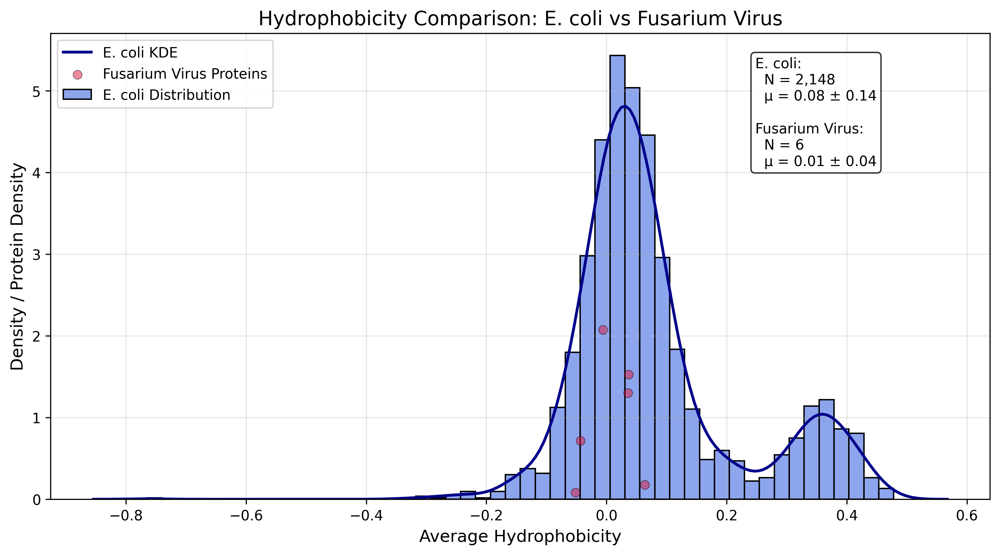

# Introduction
Make sure to have a look at the suggested powerpoint to help guide you! Include some pictures (make sure to cite sources!)

- **Viral classification:**
  - *ICTV classification*: 

  Realm: Riboviria 
  Kingdom: Orthornavirae 
  Phylum: Duplornaviricota 
  Class: Chrymotiviricetes  
  Order: Ghabrivirales  
  Suborder: Alphatotivirineae 
  Family: Fusagraviridae 
  Genus: Fusagravirus  
  Species: Fusagravirus shichi [1](#ref-1)
  
  - *Baltimore classification*: 
   -Fusarium poae dsRNA virus 2 is classified as class III due to it being a double-stranded RNA virus, meaning that the virus will replicate in the core capsid in its' host cell's cytoplasm and each gene will code one protein [2](#ref-2)

- **Physical size:**
  - The physical size of Fusarium poae dsRNA virus 2 is approximately 40 nm, which is smaller than a typical human cell (~10,000 nm) and smaller than SARS-CoV-2 (~120 nm) [3](#ref-3)

- **Shape and envelope:**
  - The virus exhibits a icosahedral morphology and likely does not possess an envelope [4](#ref-4).

- **Discovery and outbreaks:**
  - Fusarium poae dsRNA virus 2 was first described in 2016 [5](#ref-5). The are currently no known ongoing outbreaks, it's less likely to be monitored because it infects fungi, not humans, animals, or plants [5](#ref-5).

- **Host range:**
  - This virus infects Fusarium poae, a plant-pathogenic fungus, and is host-specific [5](#ref-5).

- **Cell entry:**
  - The virus does not have an extra cellular phase it relies on intracellular transmission (horizontal transmission). "Unlike their bacteria- and higher eukaryote-infecting counterparts, most mycoviruses are transmitted by cytoplasmic interchange; they never leave the host, and indeed have no strategy for entering host cells" [4](#ref-4).

- **Replication strategy:**
  - Fusarium poae dsRNA virus 2 relies on host machinery and replicates by using its own RNA-dependent RNA polymerase that it produces in its ORF2 [5](#ref-5).

- **Release mechanism:**
  - Viral progeny are released/passed on to other fungi through horizontal transmission, which is the fusion of their hyphae. It can also be vertically transferred through spores [6](#ref-6).

- **Latency:**
  - The virus is likely asymptomatic like other mycoviruses [6](#ref-6).

- **Equilibrium and antigenic shift:**
  - The virus does not affect humans, and does not appear to have an antigenic shift due to its stable intracellular existance [6](#ref-6).

- **Vaccines:**
  - I could not find any evidence of a vaccine or treatment for this virus.

- **Antiviral drugs:**
  - I could not find any evidence of an antiviral drug or treatment for this virus.

# Methods

1. **First, I downloaded the viral sequence by accession number, and selected XXX close relatives to identify a most recent common ancesstor**

```python
from Bio import Entrez
Entrez.email = "sfield7@charlotte.edu"
handle = Entrez.efetch(db="nucleotide", id="KU728180", rettype="fasta", retmode="text")
record = handle.read()
handle.close()

with open("KU728180.fasta", "w") as f:
    f.write(record)
```
2. **I then found the Open Reading Frames that were larger than 300 base pairs**

```python
from Bio import SeqIO

file_path = "KU728180.fasta"
record = SeqIO.read(file_path, "fasta")
sequence = record.seq

def find_orfs(sequence, min_length=300):
    orfs = []
    for frame in range(3):
        translated = sequence[frame:].translate()
        start = None
        for i in range(len(translated)):
            if translated[i] == 'M' and start is None:
                start = i
            elif translated[i] == '*' and start is not None:
                if i - start >= min_length:
                    orfs.append(sequence[frame + start*3 : frame + i*3])
                start = None
    return orfs

orfs = find_orfs(sequence, min_length=300)

with open("KU728180_ORFs.fasta", "w") as output_file:
    for idx, orf in enumerate(orfs, 1):
        output_file.write(f">ORF_{idx}\n{orf}\n")
```
e.g.
Align your sequences using the MAFFT slurm script
```bash
#!/bin/bash
#SBATCH --job-name=mafft_align
mafft --auto input.fasta > aligned.fast
```
3. **I then translated the ORFS to Proteins**

```python
from Bio import SeqIO

orfs = list(SeqIO.parse("KU728180_ORFs.fasta", "fasta"))
proteins = []

for orf in orfs:
    protein_seq = orf.seq.translate(to_stop=True)
    proteins.append(protein_seq)

with open("KU728180_proteome.fasta", "w") as out_file:
    for idx, prot in enumerate(proteins, 1):
        out_file.write(f">Protein_{idx}\n{prot}\n")

print(f"{len(proteins)} proteins saved to KU728180_proteome.fasta")
```
4. **The next step was retrieving the related sequences by accession**
```python
import numpy as np
from Bio import Entrez
# In order to import from the python file without hassle, we add the current directory to the
python path
import sys; sys.path.append(".")
email = "sfield7@charlotte.edu

accession_codes = {
  "accession_codes":[
    #Fusagraviridae
    "JN671443", "KU728181", "GQ140626", "KP900891", "MK780821", "MW258947",
    "KX821737", "MZ736512", "LC333734", "MT876190", "LC333739", "MG897472",
    "MT520144", "KJ549662", "LC651180", "JN671444"
    
    #Chrysoviridae
    "KT950839", "MK584819", "AB700631"
    
    #outgroup
    "MH057693"
]
```

5. **Downloading the Viral Genome Sequences**
```python
from Bio import Entrez
import time

Entrez.email = "sfield7@charlotte.edu"

def fetch_fasta_sequences(accession_list):
    sequences = {}
    
    for accession in accession_list:
        try:
            with Entrez.efetch(
              db="nucleotide", 
              id=accession, 
              rettype="fasta", 
              retmode="text") as handle:
                fasta_data = handle.read().strip()
                sequences[accession] = fasta_data
                print(f"Retrieved: {accession}")
                time.sleep(0.35)
                
        except Exception as e:
            print(f"Error retrieving {accession}: {str(e)}")
            sequences[accession] = None
            
    return sequences
    accession_list = [
    "JN671443", "KU728181", "GQ140626", "KP900891", "MK780821", "MW258947",
    "KX821737", "MZ736512", "LC333734", "MT876190", "LC333739", "MG897472",
    "MT520144", "KJ549662", "LC651180", "JN671444"
]

sequences = fetch_fasta_sequences(accession_list)

with open("all_sequences.fasta", "w") as f:
    for acc, seq in sequences.items():
        if seq:
            f.write(seq + "\n")
```

6. **Align using Mafft**
```python
from Bio import Entrez, SeqIO
from io import StringIO

def calculate_sequence_lengths(sequences, accession_codes):
    print("\n{:40} | {:15} | {}".format("Virus Name", "Accession", "Sequence Length"))
    print("-" * 70)

    for name, accession in accession_codes.items():
        fasta = sequences.get(name)
        if not fasta:
            print(f"{name[:40]:40} | {accession:15} | {'Retrieval failed':15}")
            continue

        try:
            record = SeqIO.read(StringIO(fasta), "fasta")
            print(f"{name[:40]:40} | {accession:15} | {len(record.seq):,} bp")
        except Exception as e:
            print(f"{name[:40]:40} | {accession:15} | {'Invalid format':15}")
            
# Calculate and display lengths
calculate_sequence_lengths(fasta_sequences, accession_codes)
```
```bash
mafft --auto all_sequences.fasta > all_sequences_aligned.fasta
```

7. **Creating a Phylogenetic Tree**
```python
from Bio import Phylo, AlignIO
from Bio.Phylo.TreeConstruction import DistanceCalculator, DistanceTreeConstructor
# Step 1: Read the alignment
aln = AlignIO.read("all_sequences_aligned.fasta", "fasta")
print("Alignment loaded with", len(aln), "sequences.")
# Step 2: Compute the distance matrix
calculator = DistanceCalculator('identity')
distance_matrix = calculator.get_distance(aln)
print("Distance matrix:\n", distance_matrix)
# Step 3: Construct the tree using Neighbor-Joining
constructor = DistanceTreeConstructor()
nj_tree = constructor.nj(distance_matrix)
# Optional: Construct UPGMA tree
# upgma_tree = constructor.upgma(distance_matrix)
# Step 4: Display the tree
Phylo.draw(nj_tree)
# Step 5: Save the tree in Newick format
Phylo.write(nj_tree, "virus_tree.nwk", "newick")
print("Tree saved to virus_tree.nwk")
```

8. **Creating the Hydrophobicity plot**
```python
import matplotlib.pyplot as plt
from Bio import SeqIO
import numpy as np

    hydrophobicity_scale = {
        'A': 1.8, 'C': 2.5, 'D': -3.5, 'E': -3.5, 'F': 2.8, 'G': -0.4, 
        'H': -0.2, 'I': 4.5, 'K': -3.9, 'L': 3.8, 'M': 1.9, 'N': -3.5, 
        'P': -1.6, 'Q': -3.5, 'R': -4.5, 'S': -0.8, 'T': -0.7, 'V': 4.2, 
        'W': -0.9, 'Y': -1.3
    }
    score = 0
    for amino_acid in sequence:
        score += hydrophobicity_scale.get(amino_acid, 0)
    return score / len(sequence)

viral_proteins = all_sequences_aligned.fasta

viral_hydrophobicity_scores = [calculate_hydrophobicity(seq) for seq in viral_proteins]

ecoli_proteins = ecoli_proteome_filtered.fasta
ecoli_hydrophobicity_scores = [calculate_hydrophobicity(seq) for seq in ecoli_proteins]

plt.figure(figsize=(10,6))

plt.hist(ecoli_hydrophobicity_scores, bins=50, alpha=0.5, label='E. coli Proteome', color='gray')
for score in viral_hydrophobicity_scores:
    plt.axvline(score, color='red', linestyle='dashed', linewidth=2)  # Add red vertical lines for viral proteins

plt.xlabel('Hydrophobicity Score')
plt.ylabel('Frequency')
plt.title('Hydrophobicity Comparison: Viral Proteins vs. E. coli Proteome')
plt.legend(['Viral Proteins', 'E. coli Proteome'])

```

9. **Comparing the genome sizes**

Has been modified for my virus, but I didn't change the comments.

```python
import pandas as pd
import seaborn as sns
import matplotlib.pyplot as plt

# Load the data
df = pd.read_csv("viral_metadata.csv")

# Clean the data
df = df.dropna(subset=["Length", "Molecule_type"])
df["Length"] = pd.to_numeric(df["Length"], errors="coerce")
df = df.dropna(subset=["Length"])

# Set up plot
plt.figure(figsize=(12, 7))
sns.set_style("whitegrid")

# Create a color palette
palette = sns.color_palette("viridis", n_colors=df["Molecule_type"].nunique())
color_dict = dict(zip(df["Molecule_type"].unique(), palette))

# Create overlapping histograms
for molecule_type in df["Molecule_type"].unique():
    sns.histplot(
        data=df[df["Molecule_type"] == molecule_type],
        x="Length",
        element="step",
        kde=True,
        log_scale=True,
        color=color_dict[molecule_type],
        label=molecule_type,
        alpha=0.65
    )

# Customize plot
plt.title("Viral Genome Length Distribution by Molecule Type", fontsize=14, pad=20)
plt.xlabel("Genome Length (log scale)", fontsize=12)
plt.ylabel("Frequency", fontsize=12)
plt.legend(title="Molecule Type", title_fontsize=12, fontsize=10)

# Add grid customization
plt.grid(True, which="both", linestyle="--", alpha=0.3)

# Add statistical annotations
plt.text(0.95, 0.95,
         f"Total Genomes: {len(df):,}\nUnique Types: {df['Molecule_type'].nunique()}",
         transform=plt.gca().transAxes,
         ha="right",
         va="top",
         bbox=dict(facecolor="white", alpha=0.8))

#Here we want to add a line to show where SARS-CoV-2 falls compared to your other viruses you downloaded.
#observed_length = 9518  #uncomment this line and fill in the length of the SARS-CoV-2 genome from the Part 1 of Lab 9
# Add a vertical red dotted line #do not uncomment this line, it is a comment
plt.axvline(x=observed_length, color='red', linestyle=':', linewidth=2, label='KU728180')


# Adjust layout and save
plt.tight_layout()
plt.savefig("viral_genome_histogram.png", dpi=300, bbox_inches='tight')
plt.show()
```
# Results and Discussion

## Figure 1: Hydrophobicity Plot Against the E.coli Proteome


N=2,148 E. coli proteins, with mean μ=0.08±0.14

N= 6 Fusarium virus, with mean = μ=0.01±0.04

The average hydrophobicity of my virus is just over zero, almost zero. The indicatorsfor the virus are located within the main peak of the E. coli distribution, indicating that they have roughly similar in hydrophobic profile to most E. coli proteins.

The outliers were a protein that encodes for RNA-dependant RNA polymerase and a hypothetical protein. The RNA-dependant RNA polymerase is important because it's the protein that allows the virus to replicate its genome and synthesize RNA within the host. The hypothetical protein is one the NCBI predicts exists within the genome, but there's no published evidence of its translation or if it's even expressed by the virus.


## Figure 2: Comparing My Virus's Genome Size to Other Viruses


My virus is 9518 bp according to NCBI. This puts it right around the 10^4 on the x-axis, which is further to the right of the average. It seems a bit uncharacteristic since it appears most other dsRNA is closer to 1000bp.


## Figure 3: Phylogentic Tree


From IQ-TREE, the model of best fit is: TVM+F+I+G4. TVM allows for different rates of transversions, F assumes that the base frequencies are not equal, I accounts for evolutionarily conserved positions of the sequence, and G4 accounts for subsitution rates that cary across sites.
The bootstrap values are not the strongest throughout the tree, while there are several 100s listed at the clade level, there's less certainty as you move back through the tree towards the nodes.The closest relatives to my virus (KU728180) are Fusagravirus jyu (KP900891), Fusagravirus jyugo (MK780821), and Fusagravirus jyushi (MG897472). This makes sense since they are all viruses that target Fusarium. It also indicates that a host switch has not occurred.

# References Cited

<a id="ref-1"></a>
[1] Taxon Details | ICTV. (n.d.). International Committee on Taxonomy of Viruses.  
https://ictv.global/taxonomy/taxondetails?taxnode_id=202418125&ictv_id=ICTV202318125 [↩](#ref-1)

<a id="ref-2"></a>
[2] News-Medical. (2019, February 26). The Baltimore classification system.  
https://www.news-medical.net/life-sciences/The-Baltimore-Classification-System.aspx [↩](#ref-2)

<a id="ref-3"></a>
[3] Virus Properties (Report) | ICTV. (n.d.). Virus properties and characteristics.  
https://ictv.global/report/chapter/information/information/virus_properties [↩](#ref-3)

<a id="ref-4"></a>
[4] Luque, D., Mata, C. P., Suzuki, N., Ghabrial, S. A., & Castón, J. R. (2018). Capsid structure of dsRNA fungal viruses.  
Viruses, 10(9), 481. https://doi.org/10.3390/v10090481 [↩](#ref-4)

<a id="ref-5"></a>
[5] Wang, L., Zhang, J., Zhang, H., Qiu, D., & Guo, L. (2016). Two Novel Relative Double-Stranded RNA Mycoviruses Infecting Fusarium poae Strain SX63. International Journal of Molecular Sciences, 17(5), 641. https://doi.org/10.3390/ijms17050641

<a id="ref-6"></a>
[6] Li, P., Bhattacharjee, P., Wang, S., Zhang, L., Ahmed, I., & Guo, L. (2019). Mycoviruses in Fusarium species: an update.  
Frontiers in Cellular and Infection Microbiology, 9. https://doi.org/10.3389/fcimb.2019.00257 [↩](#ref-6)
