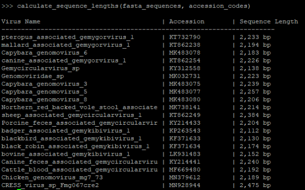
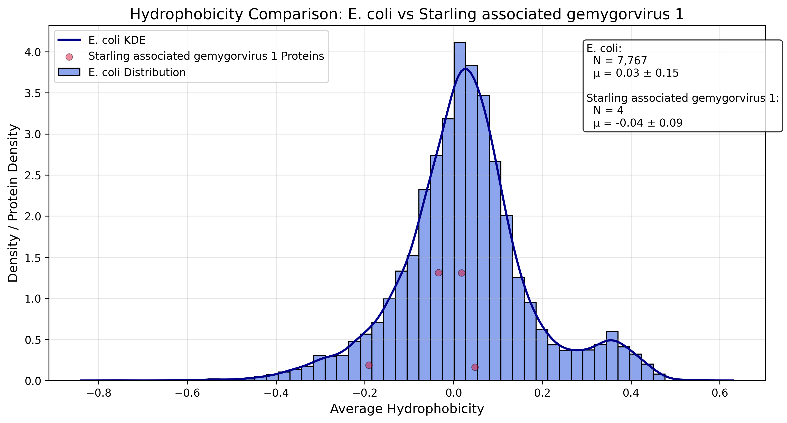
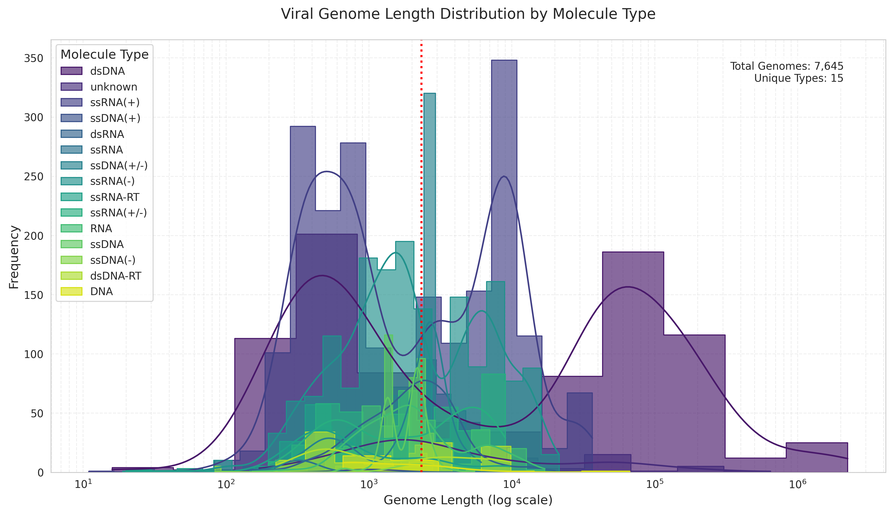

# Final Project
For this project, I selected the Starling Associated Gemygorvirus 1 virus.

Viral classification: 
ICTV classification: 
- Realm: Monodnaviria
- Kingdom: Shotokuvirae
- Phylum: Cressdnaviricota
- Class: Repensiviricetes
- Order: Geplafuvirales
- Family: Genomoviridae
- Genus: Gemygorvirus
- Species: Gemygorvirus stara1

Baltimore classification: Class 2: ssDNA(+/-)

# Introduction
I was unable to find specific measurements of the Starling Associated Gemygorvirus 1 virus (StGGV1), but other viruses in the Genomoviridae family and Gemykrogvirus species were recorded to be approximately 20-23 nanometers in diameter. This virus is significantly smaller than SARS-CoV-2 and the human cell. StGGV1 is 5,000 times smaller than a human cell and four times smaller than SARS-CoV-2. Starling Associated Gemygorvirus 1 is a non-enveloped, round virus with T=1 icosahedral symmetry. The spherical shape results from the virus’s capsid protein, which is composed of 20 identical triangular faces, and the virus doesn’t have an outer lipid envelope. 

This virus was first described in a 2013 publication by A. Sikorski titled “Novel myco-like DNA viruses discovered in the faecal matter of various animals”. The last known outbreak remains unknown. Based on my research, the starling-associated gemygorvirus 1 virus is not associated with disease. Because the virus poses little threat to humans and there isn’t much funding, there is little research on this avian virus. This virus specifically infects starlings (Sturnus vulgaris). There is no current evidence that it infects humans or mammals. The Gemygorvirus family is known to have a natural host of birds and mammals.

There is currently no direct information on how this virus penetrates the cell, but based on other viruses in the Genomoviridae family and other single-celled viruses with similar structure, the virus may attach to the host cell receptors to release its single-stranded DNA into the cytoplasm. The replication of Gemygorvirus includes: the virus attaching to the host cell, and the genomic DNA penetrating the cytoplasm. Then, ssDNA is converted into dsDNA, hijacking the host cell. Next, the viral genes are transcribed, and the genome is replicated. Evidence supports that this virus goes through rolling circle replication. Finally, the genome is assembled and the virions are released.

At this time, there is no evidence that Starling Associated Gemygorvirus 1 shows signs of latency. There is very little research on this virus and I could not find any data on latency associated with StGGV1. There is also no data on how this specific virus penetrates the host genome or its replication cycle. Overall, the latency of Starling Associated Gemygorvirus 1 is inconclusive. I could not find evidence on how the Starling Associated Gemygorvirus 1 virus releases into the cell, but based on other ssDNA circular viruses and non-enveloped viruses, the virus probably causes cell lysis to leave the host and release more virus particles.

The Starling Associated Gemygorvirus 1 is not in equilibrium with humans, and there is no evidence that antigenic shift has taken place. At the moment, the natural hosts of this virus are starlings, while the Gemygorvirus family is known for infecting fungi, birds, and mammals; there is no current evidence that they can infect humans. Due to the low threat to humans and lack of disease association, there are no vaccines or anti-viral drugs available for this virus. 

# Bioinformatics pipline:
- Download the Starling Associated Gemygorvirus 1 sequence by accession number: there are 2338 bp in this virus.
```
from Bio import Entrez Entrez.email = "tarmst15@charlotte.edu" handle = Entrez.efetch(db="nucleotide", id="KF371632", rettype="fasta", retmode="text") #chnage id with your accession number record = handle.read() handle.close() To save your fasta file with open("KF371632.fasta", "w") as f: f.write(record)
```
- Find open reading frames longer than 300bp
```
python
find_orfs()
find_all_orfs()
from Bio import SeqIO
from Bio.Seq import Seq
from typing import List, Dict

def find_orfs(seq_record: SeqIO.SeqRecord, min_length: int = 30) -> List[Dict]:
    """
    Find all open reading frames (ORFs) in a sequence record
    
    Args:
        seq_record: Biopython SeqRecord object containing the sequence
        min_length: Minimum ORF length in nucleotides (default: 30)
        
    Returns:
        List of dictionaries with ORF information
    """
    orfs = []
    sequence = seq_record.seq
    seq_length = len(sequence)
    
    # Define genetic code parameters
    start_codons = ['ATG', 'GTG', 'TTG']
    stop_codons = ['TAA', 'TAG', 'TGA']
    
    # Check all six reading frames (3 forward, 3 reverse)
    for frame in range(6):
        # Set frame parameters
        is_reverse = frame >= 3
        frame_offset = frame % 3
        
        # Get appropriate sequence for frame
        if is_reverse:
            working_seq = sequence.reverse_complement()
        else:
            working_seq = sequence
            
        # Adjust for frame offset
        working_seq = working_seq[frame_offset:]
        
        # Scan through the sequence
        pos = 0
        while pos + 3 <= len(working_seq):
            codon = str(working_seq[pos:pos+3])
            
            if codon in start_codons:
                start = pos
                end = pos + 3
                has_stop = False
                
                # Look for stop codon
                while end + 3 <= len(working_seq):
                    codon = str(working_seq[end:end+3])
                    if codon in stop_codons:
                        has_stop = True
                        end += 3
                        break
                    end += 3
                
                if has_stop:
                    orf_length = end - start
                    if orf_length >= min_length:
                        # Convert positions to original sequence coordinates
                        if is_reverse:
                            original_start = seq_length - (frame_offset + end)
                            original_end = seq_length - (frame_offset + start)
                        else:
                            original_start = frame_offset + start
                            original_end = frame_offset + end
                            
                        orfs.append({
                            'sequence_id': seq_record.id,
                            'start': original_start,
                            'end': original_end,
                            'length': orf_length,
                            'strand': '-' if is_reverse else '+',
                            'frame': frame + 1,
                            'protein': working_seq[start:end].translate()
                        })
                pos = end  # Skip past this ORF
            else:
                pos += 3  # Move to next codon
                
    return orfs

def find_all_orfs(genome_file: str, min_length: int = 30) -> List[Dict]:
    """
    Find all ORFs in a genome file (FASTA/GenBank format)
    
    Args:
        genome_file: Path to input file
        min_length: Minimum ORF length in nucleotides
        
    Returns:
        List of ORF dictionaries from all sequences in file
    """
    all_orfs = []
    
    # Auto-detect file format
    file_format = 'fasta' if genome_file.endswith(('.fasta', '.fa')) else 'genbank'
    
    with open(genome_file, 'r') as fh:
        for record in SeqIO.parse(fh, file_format):
            orfs = find_orfs(record, min_length)
            all_orfs.extend(orfs)
    
    return all_orfs

orfs = find_all_orfs("KF371632.fasta")

long_orfs = [orf for orf in orfs if orf['length'] >= 300]
print(f"Found {len(long_orfs)} ORFs longer than 300bp")
```
>Found 4 orfs longer than 300 bp

-Export your proteome file
```
pip install seaborn
cp /projects/class/binf3101_001/aminoacid_properties.csv ~/final
cp /projects/class/binf3101_001/my_helpers.py ~/final
module load python
Python
from my_helpers import find_all_orfs
orfs = find_all_orfs("KF371632.fasta")
long_orfs = [orf for orf in orfs if orf['length'] >= 300]

from typing import List, Dict

def export_trimmed_proteins(orfs: List[Dict], output_filename: str) -> None:
    """
    Export ORF protein sequences in FASTA format with stop codons removed
    
    Args:
        orfs: List of ORF dictionaries (from find_orfs/find_all_orfs)
        output_filename: Name for output FASTA file
    
    Returns:
        None (writes to file)
    """
    with open(output_filename, 'w') as fasta_file:
        for i, orf in enumerate(orfs, 1):
            # Trim trailing stop codon and convert to string
            protein_seq = str(orf['protein']).rstrip('*')
            
            # Create informative FASTA header
            header = (
                f">{orf['sequence_id']}_ORF{i}|"
                f"start={orf['start']}|end={orf['end']}|"
                f"strand={orf['strand']}|length={orf['length']}aa"
            )
            
            # Write formatted sequence (60 chars per line)
            fasta_file.write(header + "\n")
            for j in range(0, len(protein_seq), 60):
                fasta_file.write(protein_seq[j:j+60] + "\n")
export_trimmed_proteins(long_orfs, "KF371632_proteome.fasta")
exit()
```

- Gather other viruses:
>There were only 4 other viruses in the Gemygorvirus genus, so I downloaded all of those, 15 viruses from the Genomoviridae family, and "CRESS_virus_sp_Fmg067cre2" : "MN928944" as an outgroup from the Geplafuvirales order

- Format an "accession codes" object:
```
module load python
python
import numpy as np
from Bio import Entrez
import sys; sys.path.append(".")
email = "tarmst15@charlotte.edu"
 accession_codes = {
     #Gemygorvirus
     "pteropus_associated_gemygorvirus_1" : "KT732790",
     "mallard_associated_gemygorvirus_1" : "KT862238",
     "Capybara_genomovirus_6" : "MK483078",
     "canine_associated_gemygorvirus_1" : "KT862254",

     # Genomoviridae
     "Gemycircularvirus_sp" : "KY312558",
     "Genomoviridae_sp" : "MK032731",
     "Capybara_genomovirus_3" : "MK483075",
     "Capybara_genomovirus_5" : "MK483077",
     "Capybara_genomovirus_8" : "MK483080",
     "Northern_red_backed_vole_stool_associated_gemycircularvirus_110" : "MK738141",
     "sheep_associated_gemycircularvirus_1" : "KT862249",
     "Porcine_feces_associated_gemycircularvirus" : "KY214433",
     "badger_associated_gemykibivirus_1" : "KP263543",
     "blackbird_associated_gemykibivirus_1" : "KF371633",
     "black_robin_associated_gemykibivirus_1" : "KF371634",
     "bovine_associated_gemykibivirus_1" : "LK931483",
     "Canine_feces_associated_gemycircularvirus" : "KY214441",
     "Cattle_blood_associated_gemycircularvirus" : "MF669480",
     "Chicken_genomovirus_mg7_73" : "MN379612",

     #outgroup:
     "CRESS_virus_sp_Fmg067cre2" : "MN928944",
 }
from Bio import Entrez
import time

def fetch_coronavirus_fasta(accession_codes, email="your.email@example.com"):
    """
    Fetch FASTA sequences from Entrez using given accession codes.
    
    Args:
        accession_codes (dict): Dictionary of {name: accession_number}
        email (str): Valid email for NCBI API usage
    
    Returns:
        dict: {name: fasta_string} dictionary containing FASTA-formatted sequences
    """
    Entrez.email = email
    sequences = {}
    
    for name, accession in accession_codes.items():
        try:
            with Entrez.efetch(
                db="nucleotide",
                id=accession,
                rettype="fasta",
                retmode="text"
            ) as handle:
                fasta_data = handle.read().strip()
                sequences[name] = fasta_data
                print(f"Retrieved {name} ({accession})")
                time.sleep(0.35)  # NCBI recommends <3 requests/sec
            
        except Exception as e:
            print(f"Error retrieving {name} ({accession}): {str(e)}")
            sequences[name] = None  # Store None for failed retrievals
    
    return sequences

fasta_sequences = fetch_coronavirus_fasta(accession_codes, email)

# Save all sequences to a combined FASTA file
with open("coronavirus_sequences.fasta", "w") as f:
    for name, fasta in fasta_sequences.items():
        if fasta:
            f.write(fasta + "\n\n")

Calculate sequence lengths
from Bio import Entrez
from Bio import SeqIO
from io import StringIO
import time

def calculate_sequence_lengths(sequences, accession_codes):
    print("\n{:40} | {:15} | {}".format("Virus Name", "Accession", "Sequence Length"))
    print("-" * 70)
    
    for name, accession in accession_codes.items():
        fasta = sequences.get(name)
        if not fasta:
            print(f"{name[:40]:40} | {accession:15} | {'Retrieval failed':15}")
            continue
            
        try:
            record = SeqIO.read(StringIO(fasta), "fasta")
            print(f"{name[:40]:40} | {accession:15} | {len(record.seq):,} bp")
        except Exception as e:
            print(f"{name[:40]:40} | {accession:15} | {'Invalid format':15}")
```
- Calculate and display lengths
```
calculate_sequence_lengths(fasta_sequences, accession_codes)
```


Fig. 1 Calculated virus lengths.

- MAFFT alignment
```
#!/bin/bash
#SBATCH --partition=Centaurus
#SBATCH --job-name=mafft
#SBATCH --nodes=8
#SBATCH --ntasks-per-node=1
#SBATCH --time=48:00:00
#SBATCH --mem-per-cpu=200G

echo "======================================================"
echo "Start Time  : $(date)"
echo "Submit Dir  : $SLURM_SUBMIT_DIR"
echo "Job ID/Name : $SLURM_JOBID : $SLURM_JOB_NAME"
echo "Node List   : $SLURM_JOB_NODELIST"
echo "Num Tasks   : $SLURM_NTASKS total [$SLURM_NNODES nodes @ $SLURM_CPUS_ON_NODE CPUs/node]"
echo "======================================================"
echo ""


mkdir tmp
export TMPDIR=$SLURM_SUBMIT_DIR/tmp

module load mafft
cd $SLURM_SUBMIT_DIR

mafft --6merpair --thread 8 --addfragments sequences.fasta KF371632.fasta > all_sequences_aligned.fasta


echo ""
echo "======================================================"
echo "End Time   : $(date)"
echo "======================================================"
```

- Infer your phylogeny using iqtree, make note of the model selection used, make sure to also bootstrap the values.
```
#!/bin/bash
#SBATCH --partition=Centaurus
#SBATCH --job-name=iqtree
#SBATCH --nodes=1
#SBATCH --ntasks-per-node=1
#SBATCH --time=48:00:00
#SBATCH --mem-per-cpu=200G


echo "======================================================"
echo "Start Time  : $(date)"
echo "Submit Dir  : $SLURM_SUBMIT_DIR"
echo "Job ID/Name : $SLURM_JOBID : $SLURM_JOB_NAME"
echo "Node List   : $SLURM_JOB_NODELIST"
echo "Num Tasks   : $SLURM_NTASKS total [$SLURM_NNODES nodes @ $SLURM_CPUS_ON_NODE CPUs/node]"
echo "======================================================"
echo ""


mkdir tmp
export TMPDIR=$SLURM_SUBMIT_DIR/tmp


module load iqtree
cd $SLURM_SUBMIT_DIR


iqtree2 -s all_sequences_aligned.fasta -bb 1000 -m TEST


echo ""
echo "======================================================"
echo "End Time   : $(date)"
echo "======================================================"
```

cat all_sequences_aligned.fasta.treefile
(KF371632.1:0.0049468507,((KT732790.1_Pteropus_associated_gemygorvirus_1_isolate_Tbat_A_103952_:0.3181976532,(KT862238.1_Faeces_associated_gemycircularvirus_14_isolate_4_Fec7_duck_:0.3757956985,KT862254.1_Canine_associated_gemygorvirus_1_isolate_53_Fec7_dog_:0.3492495301)89:0.0703468894)100:0.2245937966,(((MK483078.1_Capybara_genomovirus_6_isolate_cap1_100_:0.4684436384,(KF371634.1_Faecal-associated_gemycircularvirus_8_:0.4184235047,KY214441.1_Canine_feces-associated_gemycircularvirus_isolate_South_Douro_:0.3686189243)100:0.1375634316)49:0.0648566806,((MK738141.1_Northern_red-backed_vole_stool-associated_gemycircularvirus_110_isolate_MR-110_:0.5027597338,KT862249.1_Sheep_associated_gemycircularvirus_1_isolate_47_Fec80064_sheep_:0.5566842728)48:0.0795609804,(((KY214433.1_Porcine_feces-associated_gemycircularvirus_isolate_BEL/15V010_:0.5145242311,(LK931483.1:0.3018743918,MN379612.1_Chicken_genomovirus_mg7_73_:0.3451050499)100:0.1153464029)98:0.0859924611,KP263543.1_Badger_feces-associated_gemycircularvirus_strain_588t_:0.6190288311)100:0.0944864789,KF371633.1_Faecal-associated_gemycircularvirus_9_:0.5078914028)62:0.0348608369)24:0.0281108938)70:0.0322930240,((MK032731.1_MAG__Genomoviridae_sp._isolate_ctcd252_:0.3459802391,(MK483075.1_Capybara_genomovirus_3_isolate_cap1_53_:0.2964910955,MK483080.1_Capybara_genomovirus_8_isolate_cap1_358_:0.3126569198)100:0.0967945328)99:0.0870602722,MK483077.1_Capybara_genomovirus_5_isolate_cap1_2730_:0.4997826953)100:0.2016163727)91:0.0428680076)100:0.1192842328,((KY312558.1_Gemycircularvirus_sp._isolate_yc-19_:0.9548171103,MN928944.1_MAG__Cressdnaviricota_sp._isolate_fmg067cre2_:0.9186038547)85:0.0661102347,MF669480.1_Cattle_blood-associated_gemycircularvirus_strain_BGmv001_:1.0456091916)83:0.0409796344);

head all_sequences_aligned.fasta.contree
(KF371632.1:0.0049595619,((KT732790.1_Pteropus_associated_gemygorvirus_1_isolate_Tbat_A_103952_:0.3181978163,(KT862238.1_Faeces_associated_gemycircularvirus_14_isolate_4_Fec7_duck_:0.3757957151,KT862254.1_Canine_associated_gemygorvirus_1_isolate_53_Fec7_dog_:0.3492515490)89:0.0703444026)100:0.2245922680,(((MK483078.1_Capybara_genomovirus_6_isolate_cap1_100_:0.4684525984,(KF371634.1_Faecal-associated_gemycircularvirus_8_:0.4184262422,KY214441.1_Canine_feces-associated_gemycircularvirus_isolate_South_Douro_:0.3686224236)100:0.1375617749)49:0.0648489964,((MK738141.1_Northern_red-backed_vole_stool-associated_gemycircularvirus_110_isolate_MR-110_:0.5027693634,KT862249.1_Sheep_associated_gemycircularvirus_1_isolate_47_Fec80064_sheep_:0.5566988151)48:0.0795388242,(((KY214433.1_Porcine_feces-associated_gemycircularvirus_isolate_BEL/15V010_:0.5145409528,(LK931483.1:0.3018792720,MN379612.1_Chicken_genomovirus_mg7_73_:0.3450902505)100:0.1153659854)98:0.0859927716,KP263543.1_Badger_feces-associated_gemycircularvirus_strain_588t_:0.6190426230)100:0.0944782069,KF371633.1_Faecal-associated_gemycircularvirus_9_:0.5078892782)62:0.0348547174)24:0.0281157990)70:0.0323016827,((MK032731.1_MAG__Genomoviridae_sp._isolate_ctcd252_:0.3459838214,(MK483075.1_Capybara_genomovirus_3_isolate_cap1_53_:0.2964908367,MK483080.1_Capybara_genomovirus_8_isolate_cap1_358_:0.3126590665)100:0.0967891456)99:0.0870602721,MK483077.1_Capybara_genomovirus_5_isolate_cap1_2730_:0.4997858245)100:0.2016203469)91:0.0428630146)100:0.1192638747,((KY312558.1_Gemycircularvirus_sp._isolate_yc-19_:0.9548790579,MN928944.1_MAG__Cressdnaviricota_sp._isolate_fmg067cre2_:0.9186496893)85:0.0663756288,MF669480.1_Cattle_blood-associated_gemycircularvirus_strain_BGmv001_:1.0460068425)83:0.0406070707);

 cat all_sequences_aligned.fasta.splits.nex
#nexus


BEGIN Taxa;
DIMENSIONS ntax=21;
TAXLABELS
[1] 'KF371632.1'
[2] 'KT732790.1_Pteropus_associated_gemygorvirus_1_isolate_Tbat_A_103952_'
[3] 'KT862238.1_Faeces_associated_gemycircularvirus_14_isolate_4_Fec7_duck_'
[4] 'MK483078.1_Capybara_genomovirus_6_isolate_cap1_100_'
[5] 'KT862254.1_Canine_associated_gemygorvirus_1_isolate_53_Fec7_dog_'
[6] 'KY312558.1_Gemycircularvirus_sp._isolate_yc-19_'
[7] 'MK032731.1_MAG__Genomoviridae_sp._isolate_ctcd252_'
[8] 'MK483075.1_Capybara_genomovirus_3_isolate_cap1_53_'
[9] 'MK483077.1_Capybara_genomovirus_5_isolate_cap1_2730_'
[10] 'MK483080.1_Capybara_genomovirus_8_isolate_cap1_358_'
[11] 'MK738141.1_Northern_red-backed_vole_stool-associated_gemycircularvirus_110_isolate_MR-110_'
[12] 'KT862249.1_Sheep_associated_gemycircularvirus_1_isolate_47_Fec80064_sheep_'
[13] 'KY214433.1_Porcine_feces-associated_gemycircularvirus_isolate_BEL/15V010_'
[14] 'KP263543.1_Badger_feces-associated_gemycircularvirus_strain_588t_'
[15] 'KF371633.1_Faecal-associated_gemycircularvirus_9_'
[16] 'KF371634.1_Faecal-associated_gemycircularvirus_8_'
[17] 'LK931483.1'
[18] 'KY214441.1_Canine_feces-associated_gemycircularvirus_isolate_South_Douro_'
[19] 'MF669480.1_Cattle_blood-associated_gemycircularvirus_strain_BGmv001_'
[20] 'MN379612.1_Chicken_genomovirus_mg7_73_'
[21] 'MN928944.1_MAG__Cressdnaviricota_sp._isolate_fmg067cre2_'
;
END; [Taxa]


BEGIN Splits;
DIMENSIONS ntax=21 nsplits=106;
FORMAT labels=no weights=yes confidences=no intervals=no;
MATRIX…


# Results and Discussion

Fig. 2 Hydrophobicity of E.coli proteome vs. Starling starling associated gemygorvirus 1
This figure indicates that the distribution of average hydrophobicity for E. coli proteins are more hydrophilic than StGGV1. The E. coli proteins are slightly centered about zero, but have a broad spread. There are only 4 identified StGGV1 and they are either negative values or very close to zero. I did not identify any outlier hydrophobic proteins.


Fig. 3 Shows Starling associated gemygorvirus 1 compared to other randomized viruses from https://www.ncbi.nlm.nih.gov/labs/virus/vssi/#/virus?SeqType_s=Nucleotide. The Starling associated gemygorvirus 1 virus is 2,338 base pairs. This plot indicates that the length of Starling associated gemygorvirus 1 genome is around the average length observed for other ssDNA(+/-) viruses. 


Fig. 4 Phylogeny and model selection
MN928944 CRESS_virus_sp_Fmg067cre2 is rooted as the outgroup and the nodes are in increasing order. This virus does not suggest a switch host, however, there is no evidence about that. The closest relatives to Starling associated gemygorvirus 1 are associated gemygorvirus 1, canine associated gemygorvirus 1, and Capybara genomovirus 6. The branches are well-supported by the bootstrap values. The best fit model to infer this phylogeny is  Q.bird + F + R5. +F is the Empirical base frequencies. This is the default if the model has unequal base freq. + R4 Rate heteorogeneity, but replacing Gamma by FreeRate heterogeneity. Finally Q.bird because it uses the Q matrix (Minh et al., 2021) estimated for birds (Jarvis et al., 2015).

# References
Yao, Y., Wu, H., Sun, G., Yang, S., Shen, Q., Wang, X., & Zhang, W. (2021). Identification of diverse novel genomoviruses in gut of wild birds. Biosafety and Health, 3(3), 136-141. https://doi.org/10.1016/j.bsheal.2021.01.004

Williams, R. A., J., C., Doménech, A., Madrid, R., Fandiño, S., & Benítez, L. (2023). Emerging and Novel Viruses in Passerine Birds. Microorganisms, 11(9), 2355. https://doi.org/10.3390/microorganisms11092355

Varsani, A., & Krupovic, M. (2017). Sequence-based taxonomic framework for the classification of uncultured single-stranded DNA viruses of the family Genomoviridae. Virus Evolution, 3(1), vew037. https://doi.org/10.1093/ve/vew037

Sikorski, A., Massaro, M., Kraberger, S., Young, L. M., Smalley, D., Martin, D. P., & Varsani, A. (2013). Novel myco-like DNA viruses discovered in the faecal matter of various animals. Virus research, 177(2), 209–216. https://doi.org/10.1016/j.virusres.2013.08.008

Swiss Institute of Bioinformatics. (n.d.). Genomoviridae. ViralZone.  https://viralzone.expasy.org/7396

Swiss Institute of Bioinformatics. (n.d.). Gemycircularvirus. ViralZone. https://viralzone.expasy.org/7382

International Committee on Taxonomy of Viruses (ICTV). (2016). Create a new family, Genomoviridae (genus Gemycircularvirus), including 20 new species and 6 new unassigned viruses [Taxonomic proposal 2016.001a-agF.A.v6.Genomoviridae]. https://ictv.global/proposals-16/2016.001a-agF.A.v6.Genomoviridae.pdf

National Center for Biotechnology Information. (Year). Gemycircularvirus isolate B14-08 from Bromus hordeaceus complete genome (GenBank Accession No. KF371632). Retrieved from https://www.ncbi.nlm.nih.gov/nuccore/KF371632
