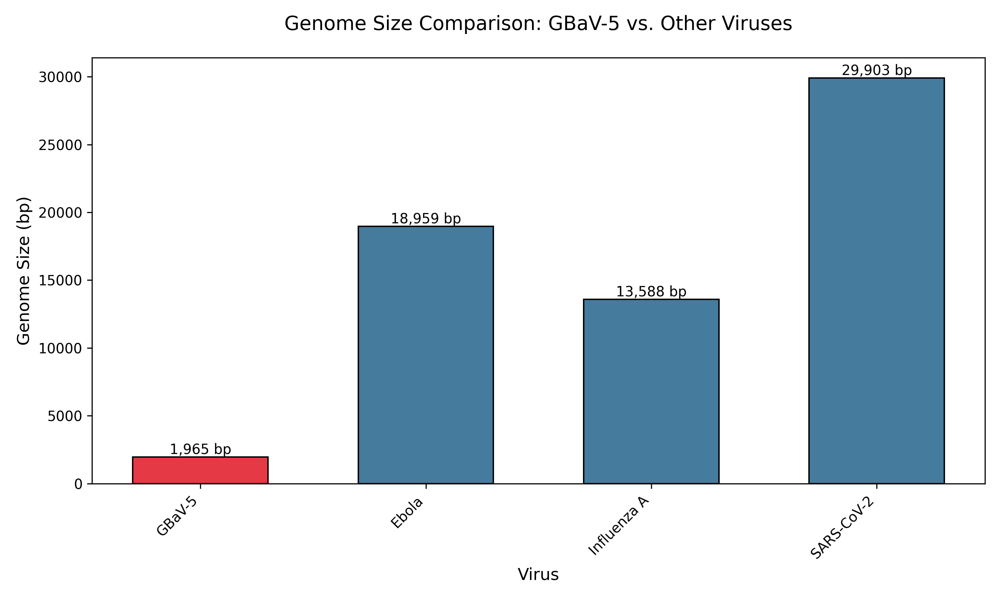
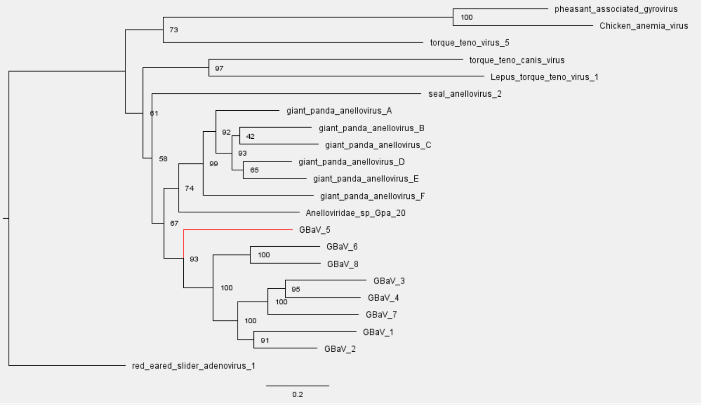
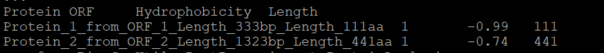

# Introduction

**Viral classification:**  

*ICTV classification* (1):
- Realm: Monodnaviria
- Kingdom: Shotokuvirae
- Phylum: Commensaviricota
- Class: Cardeaviricetes
- Order: Sanitavirales
- Family: Anelloviridae
- Genus: Pitorquevirus
- Species: Pitorquevirus ursid20

*Baltimore classification*: Class II; signle-stranded DNA (ssDNA) viruses (2).

- **Physical size:**  
The physical size of Grizzly bear anellovirus 5 (GBaV-5) is approximately 30 nm, which is smaller than a typical human cell (~10,000 nm) and smaller than SARS-CoV-2 (~120 nm) (3).

- **Shape and envelope:**  
The virus exhibits a spherical, icosahedral symmetry morphology and does not possess an envelope (3).
> **Note**: The structure of GBaV-5 has not been visualized specifically, but can be inferred from other viruses in the Anelloviridae family.

- **Discovery and outbreaks:**  
GBaV-5 was first described in 2017 (4). The most recent outbreak occurred in N/A. Anelloviruses are generally harmless and exist asymptomatically in hosts without causing disease, which indicates it is not a pathogenic relationship (5). Therefore, there have been no documented outbreaks of GBaV-5, or other anelloviruses.

- **Host range:**  
This virus infects This virus infects grizzly bears, and is host-specific (4). This reflects current data, as it has only been found in grizzly bears and anelloviruses are generally species-specific.

- **Cell entry:**  
The virus is hypothesized to penetrate the host cell via clathrin-mediated endocytosis.

- **Replication strategy:**  
GBaV-5 is hypothesized to rely on host machinery and replicates by rolling circle replication (RCR) using DNA polymerases in the nucleus. GBaV-5 lacks its own DNA polymerase, helicase, or other replication enzymes, relying entirely on the bear’s cellular machinery. The viral genome replicates via rolling circle replication, a common mechanism for circular ssDNA viruses (6).

- **Release mechanism:**  
Viral progeny are released by non-lytic exocytosis/vesicles. Similar to human Torque teno virus (TTV), GBaV-5 is hypothesized to exit cells via extracellular vesicles, enabling persistent infection without lysis (7).

- **Latency:**  
No specific studies on GBaV-5, but in human anelloviruses they usually maintain continuous replication without integration into the host genome. This suggests chronic, active persistence rather than latency (8).

- **Equilibrium and antigenic shift:**  
Anelloviruses are typically host-restricted, meaning the virus is almost certainly not in equilibrium with humans. However, it is likely in equilibrium with grizzly bears. Additionally, GBaV-5 does not show antigenic shift. It has a non-segmented, circular single-stranded DNA genome, so it lacks the structure for antigenic shift.

- **Vaccines:**  
No, vaccines are not available. Anelloviruses (including GBaV-5) are not associated with disease in bears or humans, so developing treatments isn’t a priority. Furthermore, since GBaV-5 relies on grizzly bear cellular machinery, it makes it harder to target (9).
> Excerpt from citation: *"According to their virological features, there is little doubt that trying to prevent infections would be extremely difficult in the absence of specific multivalent vaccines. There are no virostatic drugs with proven efficacy for AV infection, and what we know about the lack of AV pathogenicity would not justify specific clinical trials.”*

- **Antiviral drugs:**  
Again, no. Anelloviruses, including GBaV-5, are not associated with disease in bears or humans, so developing treatments isn’t a priority (9).

# Methods
---     

**Step 1. Download Virus Sequences**

from Bio import Entrez 
Entrez.email = "tdavi195@charlotte.edu"
handle = Entrez.efetch(db="nucleotide", id="OP629194", rettype="fasta", retmode="text")
record = handle.read()
handle.close()
with open("OP629194.fasta", "w") as f:
f.write(record)

**Step 2. Find ORFs Bigger than 300bp**

from Bio import SeqIO
from Bio.Seq import Seq
from Bio.SeqUtils import nt_search

file_path = "OP629194.fasta"
record = SeqIO.read(file_path, "fasta")
sequence = record.seq

def find_orfs(sequence, min_length=300):
    orfs = []
    for frame in range(3): # Check in all 3 frames
        translated = sequence[frame:].translate()
    start = None
    for i in range(len(translated)):
        if translated[i] == 'M' and start is None:
            start = i
    elif translated[i] == '*' and start is not None:
    if i - start >= min_length: 
            orfs.append(sequence[frame + start*3 : frame + i*3])
    start = None
    return orf

orfs = find_orfs(sequence, min_length=300)

print(f"Found {len(orfs)} ORFs longer than 300 bp.")
for idx, orf in enumerate(orfs, 1):
 print(f"ORF {idx}: Length {len(orf)} bp")

with open("OP629194_ORFs.fasta", "w") as output_file:
 for idx, orf in enumerate(orfs, 1):
    output_file.write(f">ORF_{idx}\n")
 output_file.write(f"
                   
print("ORFs saved to OP629194_ORFs.fasta")

**Step 3. Exporting the Proteome File**

from Bio import SeqIO

orfs = list(SeqIO.parse("OP629194_ORFs.fasta", "fasta"))

proteins = []
for orf in orfs:
    protein_seq = orf.seq.translate(to_stop=True)
    proteins.append(protein_seq)

with open("OP629194_proteome.fasta", "w") as out_file:
    for idx, (orf, prot) in enumerate(zip(orfs, proteins), 1):
        out_file.write(f">Protein_{idx}_from_{orf.id}_Length_{len(prot)}aa\n")
        out_file.write(str(prot) + "\n")

print(f"{len(proteins)} proteins saved to OP629194_proteome.fasta")

**Step 4. Bulk Download Sequences from NCBI**

import numpy as np
from Bio import Entrez
import sys; sys.path.append(".")
email = "tdavi195@charlotte.edu"

accession_codes = {
    "Pitorquevirus": [
        "OP629190", "OP629191", "OP629192", "OP629193", "OP629195",
        "OP629196", "OP629197", "AB076002", "MF327548", "MF327541",
        "MF327547", "MF327540", "MF327542", "MF327550", "ON638692"
    ],
    "Anelloviridae": [
        "OK665854", "KF373760", "M55918", "AF345523", "MN994854"
    ],
    "Outgroup": ["JN632576"]
}

from Bio import Entrez
import time
def fetch_fasta_sequences(accession_list, email="tdavi195@charlotte.edu"):
 Entrez.email = email
 sequences = {}
 for accession in accession_list:
 try:
 with Entrez.efetch(
 db="nucleotide",
 id=accession,
 rettype="fasta",
 retmode="text"
 ) as handle:
 fasta_data = handle.read().strip()
 sequences[accession] = fasta_data
 print(f"Retrieved: {accession}")
 time.sleep(0.35)
 except Exception as e:
 print(f"Error retrieving {accession}: {str(e)}")
 sequences[accession] = None
 return sequences

accession_list = [
    "OP629190", "OP629191", "OP629192", "OP629193", "OP629195",
    "OP629196", "OP629197", "AB076002", "MF327548", "MF327541",
    "MF327547", "MF327540", "MF327542", "MF327550", "ON638692",
    "OK665854", "KF373760", "M55918", "AF345523", "MN994854",
    "JN632576"
]

sequences = fetch_fasta_sequences(accession_list)

with open("all_sequences.fasta", "w") as f:
 for acc, seq in sequences.items():
 if seq:
 f.write(seq + "\n")

**Step 5. MAFFT Alignment**

from Bio import Entrez
from Bio import SeqIO
from io import StringIO
import time
def calculate_sequence_lengths(sequences, accession_codes):
 print("\n{:40} | {:15} | {}".format("Virus Name", "Accession", "Sequence Length"))
 print("-" * 70)

 for name, accession in accession_codes.items():
 fasta = sequences.get(name)
 if not fasta:
 print(f"{name[:40]:40} | {accession:15} | {'Retrieval failed':15}")
 continue

 try:
 record = SeqIO.read(StringIO(fasta), "fasta")
 print(f"{name[:40]:40} | {accession:15} | {len(record.seq):,} bp")
 except Exception as e:
 print(f"{name[:40]:40} | {accession:15} | {'Invalid format':15}")

calculate_sequence_lengths(fasta_sequences, accession_codes)

import subprocess
subprocess.run(["mafft", "--auto", "all_sequences.fasta"], stdout=open("all_sequences_aligned.fasta", "w"))
print("MAFFT alignment saved to 'all_sequences_aligned.fasta'")

**Step 6. Construct Phylogenetic Tree**

from Bio import Phylo, AlignIO
from Bio.Phylo.TreeConstruction import DistanceCalculator, DistanceTreeConstructor
aln = AlignIO.read("all_sequences_aligned.fasta", "fasta")
print("Alignment loaded with", len(aln), "sequences.")
calculator = DistanceCalculator('identity')
distance_matrix = calculator.get_distance(aln)
print("Distance matrix:\n", distance_matrix)
constructor = DistanceTreeConstructor()
nj_tree = constructor.nj(distance_matrix)
Phylo.draw(nj_tree)
Phylo.write(nj_tree, "virus_tree.nwk", "newick")
print("Tree saved to virus_tree.nwk")  

**Step 7. Export to FigTree and Assign Bootstrap Values from IQTree**
Following the construction of the tree, I downloaded it to my laptop and used FigTree to view the tree. Additionally, I used IQTree to add bootstrap values.
    
# Results and Discussion
---
## Figure 1: Genome Size Comparison

This graph shows the genome size difference between my virus (GBaV-5) and three well-known viruses. As you can see, GBaV-5 is a very small virus, coming in at only 1,965bp.

## Figure 2: Phylogentic Tree

From IQ-TREE, the model of best fit is: TVM+F+G4. The bootstrap values are fairly consistent within the separate clades, but there are some areas of uncertainty. The three closest relatives to my virus are GBaV-6, GBaV-8, and GBaV-3. This aligned with my expectation for 3 of the 7 additional grizzly bear anelloviruses to be closely related. It's also reasonable to infer that no host switch has occurred.

## Figure 3: Hydrophobocity Plot Error

Unfortunately, I, and others who had a Baltimore Class II virus, ran into errors when it came to generating hydrophobicity values and their respective graphs. My ORFs came back as -0.99 and -0.79. Those values are extremely hydrophilic and are uncharacteristic for anelloviruses. 

# References Cited

1. International Committee on Taxonomy of Viruses (ICTV). (2024). Virus taxonomy. https://ictv.global/taxonomy/taxondetails?taxnode_id=202420419
2. Libretexts. (2024, November 23). 9.3b: The Baltimore Virus Classification. Biology LibreTexts.
https://bio.libretexts.org/Bookshelves/Microbiology/Microbiology_(Boundless)/09:_Viruses/9.03:_Classifying_Viruses/9.3B:_The_Baltimore_Virus_Classification 
3. Anelloviridae. ICTV. (2011). https://ictv.global/report_9th/ssDNA/Anelloviridae 
4. National Center for Biotechnology Information. (2023). *GenBank sequence OP629194: GBaV-5 complete genome.* NIH. https://www.ncbi.nlm.nih.gov/nuccore/OP629194
5. Cebriá-Mendoza M, Beamud B,Andreu-Moreno I, Arbona C, Larrea L, Díaz W,,Sanjuán R, Cuevas JM, 2023. Human Anelloviruses: Influence of Demographic Factors, Recombination, and Worldwide Diversity. Microbiol Spectr11:e04928-22. 
 https://doi.org/10.1128/spectrum.04928-22
6. Sejal Modha, Joseph Hughes, Richard J Orton, Spyros Lytras, Expanding the genomic diversity of human anelloviruses, Virus Evolution, Volume 11, Issue 1, 2025, veaf002. https://doi.org/10.1093/ve/veaf002
7. Qian W, Miner CA, Ingle H, Platt DJ, Baldridge MT, Miner JJ2019. A Human STAT1 Gain-of-Function Mutation Impairs CD8+ T Cell Responses against Gammaherpesvirus 68. J Virol93:10.1128/jvi.00307-19. https://doi.org/10.1128/jvi.00307-19
8. Maggi, F., Fornai, C., Vatteroni, M.L., Siciliano, G., Menichetti, F., Tascini, C., Specter, S., Pistello, M. and Bendinelli, M. (2001), Low prevalence of TT virus in the cerebrospinal fluid of viremic patients with central nervous system disorders. J. Med. Virol., 65: 418-422. https://doi.org/10.1002/jmv.2051
